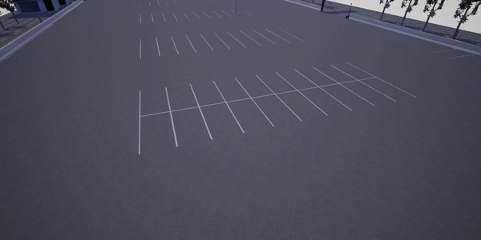
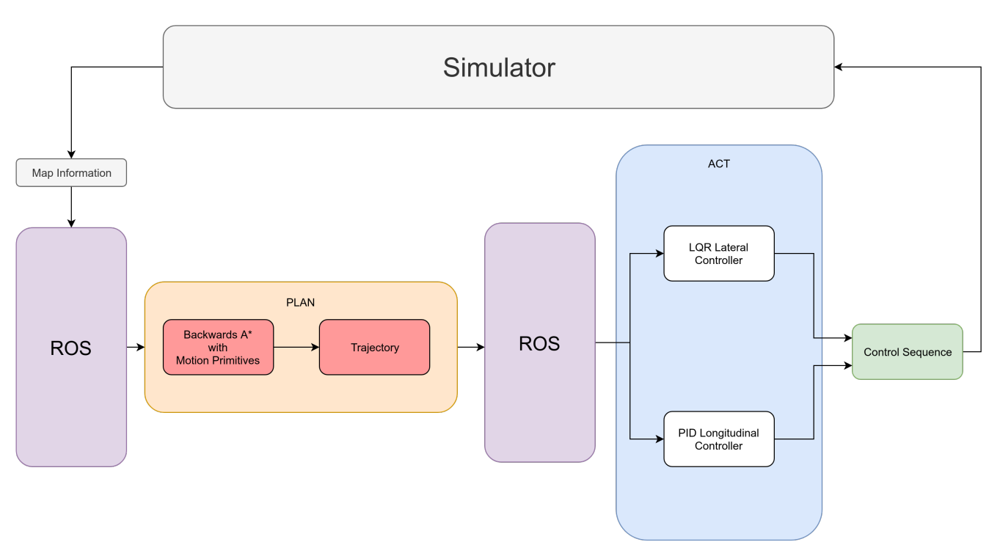

# AV_Planning
Repository for motion planning of Autonomous Vehicles in unstructured environments (pakring lots).  
A lattice based planner was developed for optimal and efficient plans for parking the ego vehicles. The computed vehicle trajectory is tracked with the help of a LQR based lateral and a PID longitudinal controller. Carla simulator was used for this project to allow a realistic physics-enabled scenario generation.  

# Architecture
The architecture consists of three subsystems: the motion planner, vehicle controller and the simulator. Motion planning subpart was developed in C++ to allow efficient computation, vehicle controller was developed in Python to take advantage of the Carla Python-API. Robotic Operating System (ROS) was used for communication between C++ and Python at each simulation step.  

# Execution Instructions
Launch the Carla simulator using:  
**$ ./CarlaUE4.sh**   
Launch the motion planner and vechicle controller ROS nodes:  
**$ rosrun AV_Parking_Planning AV_Planner**  
**$ python3 controller1.py**  

The motion planner can be run without the simulator by executing the **/scripts/global_planner.cpp** C++ script.  

The final aim of this project is to develop a motion planner for parking of multiple autonomous vehicles in a busy parking lot. This would lead to a quantitative estimation of possible gain in efficiency with connected vehicles. Currently, the architecture involves motion planning and control for a single ego vehicle.

